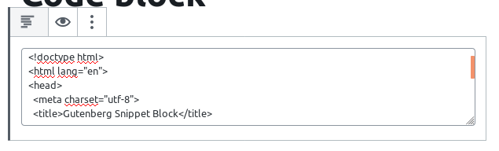
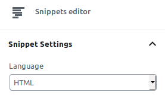
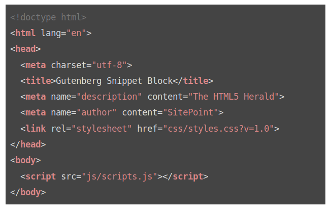

# Gutenberg Snippet block
Allows to add snippets blocks to your content: Javascript, CSS, HTML...

## Purpose
Add snippet blocks to your WordPress content using the new Gutenberg editor

## Getting Started

- Download the plugin into your 'plugins' folder.
- cd into the folder
- run `composer install` to install PHPCS
- run `npm install` to install the project dependancies
- run `npm run build` to compile the plugin assets

## How to use it
Add a Snippet block within your content


Include your code



Select the language



Save the post and check your front-end



## Supported languages

- Apache
- Bash
- C#
- C++
- CSS
- Erlang
- Go
- HTML
- XML
- Handlebars
- JSON
- Java
- JavaScript
- Markdown
- Objective C
- PHP
- Python
- R
- Ruby
- Rust
- SCSS
- SQL
- Shell
- Twig
- TypeScript


## Credits

Based in Making WordPress Do More [Block Starter Kit](https://github.com/mkdo/block-starter-kit)

Original webpack configuration (before modifications) from [Zac Gordon's Gutenberg Course](https://github.com/zgordon/gutenberg-course).

Original deploy script (before modifications) from [Garry Jones](https://github.com/GaryJones/wordpress-plugin-git-flow-svn-deploy).

Webpack HMR thanks to [Christian Glingener](https://github.com/CGlingener)

## Development

If you want to use Webpack HMR, add these lines to your `wp-config.php` file. I tried to add them to the plugin but it is not allowed by WordPress plugin reviewers

```php
$webpack_server_http_scripts_root   = 'http://localhost:3000';
$webpack_server_http_scripts_a_file = $webpack_server_http_scripts_root . '/blocks.js';

// phpcs:disable
if ( @file_get_contents( $webpack_server_http_scripts_a_file ) !== false ) {
	define( 'SW_BUNDLE_SCRIPT_BASE', $webpack_server_http_scripts_root );
}
// phpcs:enable
```

## Changelod

Read the changelog [here](CHANGELOG.md)
